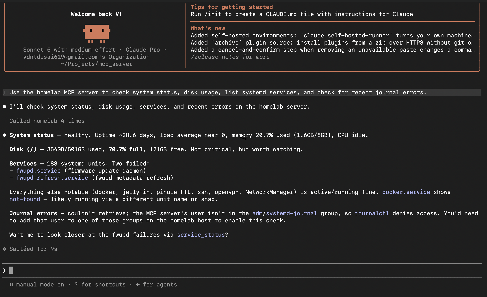

# homelab-mcp

A local-network [MCP](https://modelcontextprotocol.io) server that lets an
MCP client (Claude Code, Claude Desktop) inspect a Linux home server's
health over the network — uptime, load, memory, disk space, Docker
containers, systemd services, journal errors, and listening ports.

Built with [FastMCP](https://github.com/jlowin/fastmcp), the official
Python MCP SDK's high-level server framework.

**This server is strictly read-only.** No tool it exposes can modify
system state, restart a service, start/stop a container, or execute an
arbitrary command. It exists purely so you can ask "why is my server
using so much CPU right now?" or "did that container crash again?" from a
Claude client, without SSHing in yourself.

## Security model

- **Bearer token auth.** Every request must include
  `Authorization: Bearer <token>`. The token lives in `HOMELAB_MCP_TOKEN`
  (loaded from a `.env` file, never committed) and is checked with
  `hmac.compare_digest` to avoid timing attacks. Missing or wrong tokens
  get a `401`.
- **Read-only by design.** Every tool is implemented with a safe,
  non-mutating API (`psutil`, `shutil.disk_usage`, `docker-py`) or, where a
  subprocess is unavoidable (`systemctl`, `journalctl`), a fixed argument
  list with `shell=True` never used and any user-supplied parameter
  validated against a strict allowlist/regex before it touches the
  command line.
- **Restricted filesystem access.** The read_file and list_directory
  tools are read-only. Requested paths must be absolute, symlink targets are
  resolved before access checks, binary files are rejected, and built-in plus
  administrator-defined deny lists are enforced.
- **No rate limiting or lockout.** This server does not throttle or lock
  out repeated failed auth attempts. **Do not expose it on the open
  internet, even with the token in place.** Run it behind
  [Tailscale](https://tailscale.com/) or WireGuard, or bind it to a
  LAN-only / loopback interface via `HOMELAB_MCP_HOST`. Treat the bearer
  token like a password: anyone who has it and can reach the port has
  full read access to your server's health data.

## Setup

Requires Python 3.11+ and [`uv`](https://docs.astral.sh/uv/) (or plain
`pip`).

```bash
git clone https://github.com/VedantDesai11/homelab-mcp.git
cd homelab-mcp

cp .env.example .env
# edit .env: set HOMELAB_MCP_TOKEN to a strong random value, e.g.
#   python3 -c "import secrets; print(secrets.token_urlsafe(32))"

uv sync
# or: pip install -e .
```

### Filesystem access controls
 
The read_file tool reads regular text files and returns at most 1 MiB per
request. The list_directory tool lists one directory level and returns at
most 500 entries. Binary files are rejected. Symlink targets are resolved
before the deny lists are checked.
 
The following files are always denied:
 
- /etc/passwd
- /etc/shadow
- /etc/shadow-
- /etc/gshadow
- /etc/gshadow-
- /etc/sudoers
- /etc/sudo.conf
- /etc/crypttab
 
The following folders and all descendants are always denied:
 
- /etc/sudoers.d
- /etc/ssh
- /etc/security
- /opt/homelab_mcp
- /root
- /home
- /proc
- /sys
- /dev
- /run

Optional additional denied files and folders can be configured in .env or
through environment variables. Values are comma-separated absolute paths;
quoted and unquoted values are supported:

```bash
HOMELAB_MCP_DENIED_FILES="/testpath/file-a","/anypath/myfile"
HOMELAB_MCP_DENIED_FOLDERS="/blahblah/path","/another/path"
```

These values extend the built-in deny lists and cannot remove built-in
exclusions.

### Running locally

```bash
uv run homelab-mcp
# or: uv run python -m homelab_mcp.server
```

By default it binds `0.0.0.0:8811`. Override with `HOMELAB_MCP_HOST` /
`HOMELAB_MCP_PORT` in `.env` or the environment. The server exits
immediately with a clear error if `HOMELAB_MCP_TOKEN` is unset.

The MCP endpoint is served at `http://<host>:<port>/mcp` over Streamable
HTTP.

### Running via systemd

For a persistent deployment on the home server itself:

1. Copy the project to `/opt/homelab-mcp` (or wherever you like) and run
   `uv sync` there so `/opt/homelab-mcp/.venv` exists.
2. Copy `.env.example` to `/opt/homelab-mcp/.env` and fill in a real
   token.
3. Run the installer as root:

   ```bash
   sudo ./deploy/install.sh
   ```

   This creates a dedicated non-root `homelab-mcp` system user (if it
   doesn't already exist), installs `deploy/homelab-mcp.service` to
   `/etc/systemd/system/`, reloads systemd, and enables + starts the
   service (restarts automatically on failure).

   The installer also adds the service user to the `systemd-journal`
   group (so `recent_journal_errors` can read the journal) and, if a
   `docker` group exists on the host, to that too (so `list_containers` /
   `container_logs` can reach the Docker socket). If either group doesn't
   exist yet -- e.g. Docker isn't installed -- the installer skips it and
   says so; the corresponding tools will just report that data source as
   unavailable rather than failing the whole server.

## Connecting Claude Code / Claude Desktop

Add an MCP server entry pointing at the running instance, with the bearer
token as a header. For example, in Claude Code's MCP config:

```json
{
  "mcpServers": {
    "homelab": {
      "url": "http://your-server-hostname:8811/mcp",
      "headers": {
        "Authorization": "Bearer <your HOMELAB_MCP_TOKEN>"
      }
    }
  }
}
```

If you're on Tailscale, use the server's Tailscale hostname/IP so the
connection never leaves your tailnet.

```json
{
  "mcpServers": {
    "homelab": {
      "command": "uvx",
      "args": [
        "fastmcp-remote",
        "--header",
        "Authorization: Bearer <your HOMELAB_MCP_TOKEN>",
        "http:/your-server-hostname:8811/mcp"
      ]
    }
  }
}
```

Vaidated entry for "Claude for windows" Version 2.19675.0 (5706e5) is as follows:


## Tools

| Tool | Description |
|---|---|
| `system_status()` | Uptime, load average (1/5/15m), memory used/total, CPU count and utilization. |
| `disk_usage(path="/")` | Total/used/free/percent disk space for a given mount path. |
| `list_containers()` | Name, image, status, and port mappings for all Docker containers (running and stopped). |
| `container_logs(name, lines=100)` | Tail of logs for one named Docker container. |
| `list_services()` | All systemd service units with their load/active/sub state. |
| `service_status(unit)` | Detailed `systemctl status` output for one systemd service unit. |
| `recent_journal_errors(since="1h", priority="err")` | Recent journal entries at or above a given syslog priority. |
| `network_connections()` | Listening TCP/UDP sockets: local address, port, and owning process where permitted. |
| `read_file(path, max_bytes=1048576)` | Read a permitted regular text file. Built-in and environment-defined deny lists are enforced, binary files are rejected, and output is capped at 1 MiB. |
| `list_directory(path, max_entries=200)` | List one permitted directory level without reading file contents. Built-in and environment-defined deny lists are enforced, and output is capped at 500 entries. |

## What it looks like in practice

Once connected, the MCP client picks whichever tools are relevant to your
question and calls them directly -- no manual tool selection needed.



Here's the same session as text, from Claude Code:

> **You:** Use the homelab MCP server to check system status, disk usage,
> list systemd services, and check for recent journal errors.
>
> **Claude:** I'll check system status, disk usage, services, and recent
> errors on the homelab server.
>
> *Called homelab 4 times*
>
> **System status** — healthy. Uptime ~28.6 days, load average near 0,
> memory 20.7% used (1.6GB/8GB), CPU idle.
>
> **Disk (/)** — 354GB/501GB used, 70.7% full, 121GB free. Not critical,
> but worth watching.
>
> **Services** — 188 systemd units. Two failed: `fwupd.service` (firmware
> update daemon) and `fwupd-refresh.service` (fwupd metadata refresh).
> Everything else notable (docker, jellyfin, pihole-FTL, ssh, openvpn,
> NetworkManager) is active/running fine.
>
> **Journal errors** — retrieved cleanly (once the service user was added
> to the `systemd-journal` group by the installer -- see below).
>
> Want me to look closer at the fwupd failures via `service_status`?

Four tool calls (`system_status`, `disk_usage`, `list_services`,
`recent_journal_errors`), one natural-language question, zero SSH
sessions.

**Gotcha we hit getting here:** on the first run, `recent_journal_errors`
failed with a permissions error -- the dedicated `homelab-mcp` service
user isn't in the `adm`/`systemd-journal` groups by default, so
`journalctl` denied access even though the process itself was running
fine. `deploy/install.sh` now adds the service user to `systemd-journal`
automatically (see [Running via systemd](#running-via-systemd) above),
so a fresh install via the installer shouldn't hit this. If you set the
service up by hand instead, run:

```bash
sudo usermod -aG systemd-journal homelab-mcp
sudo systemctl restart homelab-mcp
```

## Development

```bash
uv sync --group dev
uv run pytest
```

Tests mock `psutil`, `docker-py`, and `subprocess` so the suite never
touches the real system, a real Docker daemon, or spawns real
subprocesses.
